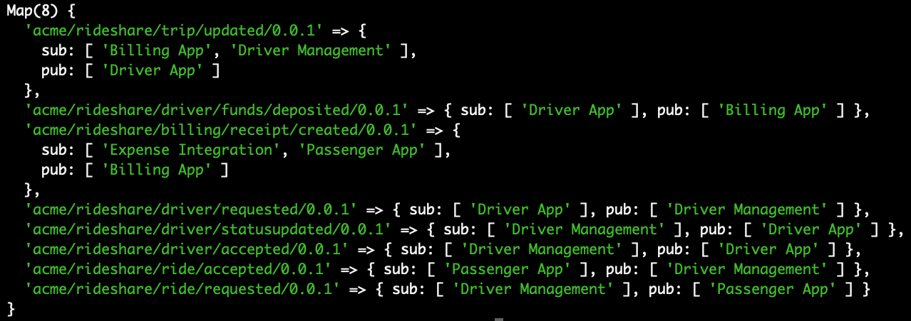
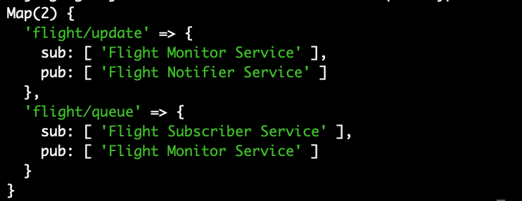

<h2>Relation Finder Prototype</h2>

<strong><i>Proof Concept</i></strong>

To verify the workflow, I developed a prototype for this project in which I tried to extract the relationships using a Map object and providing a basic output structure.

Upon executing the script on the <b>rideManagement</b> Service, we get the relations in the following custom format:

Upon executing the script on the <b>flightService</b> Service, we get the relations in the following custom format:

<b>Note:</b> This is just a basic structure and will be modified accordingly when the actual work on the
library starts. We can also provide a pure UML output.

